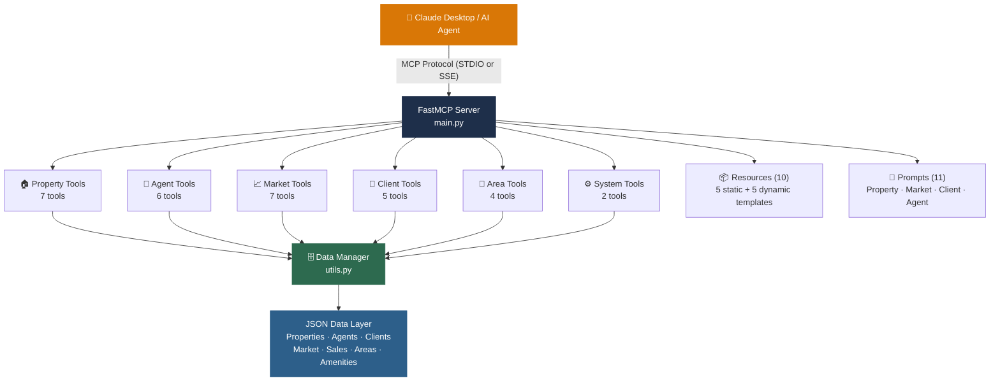

<div align="center">


<br/>

[](https://github.com/yashxsainix/real-estate-mcp)

<br/>

[](https://python.org)
[](https://modelcontextprotocol.io)
[](https://claude.ai)
[](https://pytest.org)

<br/>


</div>

---

## What This Is

A production-structured **Model Context Protocol (MCP) server** that connects Claude Desktop and other AI agents to a comprehensive real estate data platform. Once connected, Claude can search properties, analyze market trends, match clients to listings, track agent performance, and run area intelligence queries — all through natural language, powered by 30+ structured tools.

This is not a demo wrapper. It is a full modular server architecture with organized tool categories, static and dynamic resources, user-controlled prompt templates, dual transport support, and a complete integration test suite.

---

## Architecture



---

## Tool Categories

### 🏠 Property Management (7 tools)

| Tool | Description |
|------|-------------|
| `get_all_properties` | Retrieve all active listings |
| `get_property_details` | Full details for a specific property by ID |
| `search_properties` | Text search across address, description, and features |
| `filter_properties` | Multi-criteria filtering — price, bedrooms, area, type |
| `get_properties_by_area` | All listings in a specific neighborhood or zone |
| `get_properties_by_agent` | All listings assigned to a specific agent |
| `get_property_insights` | Comprehensive view with market context and comparable sales |

### 📈 Market Analysis (7 tools)

| Tool | Description |
|------|-------------|
| `get_market_overview` | Current market type, inventory, avg days on market, price trend |
| `get_price_analytics` | Median price, price per sqft, range distribution |
| `get_area_market_data` | Performance metrics for a specific area |
| `compare_areas` | Side-by-side market comparison across multiple areas |
| `get_investment_opportunities` | Rental yield data and investment segment analysis |
| `get_recent_sales` | All recent transactions with pricing and timing |
| `get_sales_by_area` | Comparable sales filtered by neighborhood |

### 👥 Agent Operations (6 tools)

| Tool | Description |
|------|-------------|
| `get_all_agents` | Full agent roster with specializations |
| `get_agent_details` | Profile, experience, and active listing count |
| `get_agent_performance` | Sales metrics, volume, and conversion stats |
| `get_top_agents` | Ranked by performance with configurable limit |
| `get_agent_listings` | All active properties assigned to an agent |
| `get_agent_dashboard` | Full dashboard view — listings, sales, performance combined |

### 🧑 Client Management (5 tools)

| Tool | Description |
|------|-------------|
| `get_all_clients` | Full client database |
| `get_client_details` | Profile, preferences, budget, and status |
| `match_client_preferences` | Matches active listings to a buyer's criteria and budget |
| `get_clients_by_status` | Filter by Active, Closed, Prospect |
| `get_client_pipeline` | Full CRM pipeline view with stage-by-stage breakdown |

### 📍 Area Intelligence (4 tools)

| Tool | Description |
|------|-------------|
| `get_area_info` | Demographics, character, and area overview |
| `get_area_amenities` | Schools, transit, dining, parks, and walkability scores |
| `get_all_areas` | Complete list of tracked neighborhoods |
| `get_city_overview` | Top-level city summary with all area comparisons |

---

## Resources

Ten MCP resources expose structured data for direct agent consumption — five static and five dynamic templates:

**Static Resources**
- `realestate://listings/active` — Current active property inventory
- `realestate://market/overview` — Market snapshot and price trend data
- `realestate://agents/roster` — Full agent directory
- `realestate://clients/database` — CRM client records
- `realestate://areas/city-overview` — City and neighborhood intelligence

**Dynamic Templates** (parameterized by ID or area name)
- `realestate://properties/{property_id}` — Individual property record
- `realestate://agents/{agent_id}/dashboard` — Agent performance view
- `realestate://clients/{client_id}/profile` — Client preference profile
- `realestate://areas/{area_name}/market` — Area-specific market data
- `realestate://areas/{area_name}/amenities` — Area amenity breakdown

---

## Prompt Templates (11)

User-controlled analysis templates across four categories. These appear in the Claude interface as slash commands or template selections:

<details>
<summary><b>🏠 Property Prompts</b></summary>

- **Property Analysis** — Structured analysis of a listing including condition, pricing, and market position
- **Property Comparison** — Side-by-side comparison of multiple properties for a buyer decision
- **Investment Evaluation** — ROI and rental yield analysis for investment properties

</details>

<details>
<summary><b>📈 Market Prompts</b></summary>

- **Market Report** — Full market summary with trends, pricing, and forecast
- **Area Comparison** — Comparative analysis of two or more neighborhoods
- **Investment Landscape** — Macro view of investment opportunities across the market

</details>

<details>
<summary><b>🧑 Client Prompts</b></summary>

- **Client Consultation** — Structured buyer or seller consultation framework
- **Property Matching Report** — Formatted report of matched listings for a client presentation
- **Client Follow-Up** — Relationship management and pipeline status summary

</details>

<details>
<summary><b>👥 Agent Prompts</b></summary>

- **Performance Review** — Agent performance dashboard and coaching notes
- **Listing Strategy** — Recommended approach for marketing a new listing

</details>

---

## Data Model

```
data/
├── properties/
│   └── active_listings.json      ← Property records with features, pricing, images, open houses
├── agents/
│   └── agent_profiles.json       ← Agent profiles, specializations, performance data
├── clients/
│   └── client_database.json      ← Buyer/seller records, preferences, budget ranges, status
├── market/
│   └── market_analytics.json     ← Price trends, inventory levels, area performance (+7.2% YoY)
├── transactions/
│   └── recent_sales.json         ← Comparable sales with pricing, timing, and area context
├── areas/
│   └── city_overview.json        ← Neighborhood profiles, demographics, character
└── amenities/
    └── local_amenities.json      ← Schools, transit, dining, parks, walkability scores
```

---

## Quick Start

**Option 1 — Claude Desktop (STDIO)**

```bash
# Clone and install
git clone https://github.com/yashxsainix/real-estate-mcp
cd real-estate-mcp
pip install -r requirements.txt

# Add to Claude Desktop config (~/.claude/claude_desktop_config.json)
```

```json
{
  "mcpServers": {
    "real-estate": {
      "command": "python",
      "args": ["/absolute/path/to/real-estate-mcp/main.py"],
      "env": {}
    }
  }
}
```

```bash
# Restart Claude Desktop — the server connects automatically
# Claude can now answer: "Search for 3-bedroom properties under $500k in Downtown Riverside"
```

**Option 2 — SSE Transport (Web / Remote)**

```bash
python main.py sse
# Server runs at http://127.0.0.1:8000/sse
# Connect any MCP-compatible client to this endpoint
```

---

## Running Tests

```bash
# Run full test suite
python run_tests.py

# Or with pytest directly
pytest tests/ -v

# Unit tests only
pytest tests/unit/ -v

# Integration tests (requires server data loaded)
pytest tests/integration/ -v
```

**Test coverage includes:**
- Unit tests for utility functions and data management
- Integration tests for all 30+ tools
- Resource access and template rendering tests
- Prompt template validation tests
- Property filtering and search accuracy tests

---

## Example Interactions

Once connected to Claude Desktop, you can ask:

```
"Find all 3-bedroom homes under $500,000 in Downtown Riverside"
→ Uses filter_properties + get_properties_by_area

"Compare the market performance of Downtown Riverside vs Eastside"
→ Uses compare_areas + get_area_market_data

"Match Sarah Johnson's buyer preferences to current listings"
→ Uses match_client_preferences + get_client_details

"Show me the top 3 agents by sales volume this quarter"
→ Uses get_top_agents + get_agent_performance

"What are the investment opportunities in the current market?"
→ Uses get_investment_opportunities + get_market_overview

"Give me a full property analysis for PROP001 with comparables"
→ Uses get_property_insights (aggregates 5 data sources automatically)
```

---

## Repository Structure

```
real-estate-mcp/
│
├── main.py                         ← Server entry point, transport selection
├── utils.py                        ← DataManager class, PropertyFilter, core logic
├── requirements.txt
│
├── tools/                          ← MCP Tools (organized by domain)
│   ├── property_tools.py           ← 7 property search and insight tools
│   ├── agent_tools.py              ← 6 agent management and performance tools
│   ├── market_tools.py             ← 7 market analysis and sales tools
│   ├── client_tools.py             ← 5 CRM and client matching tools
│   ├── area_tools.py               ← 4 neighborhood intelligence tools
│   └── system_tools.py             ← 2 data management utilities
│
├── resources/                      ← MCP Resources (static + dynamic)
│   ├── property_resources.py
│   ├── agent_resources.py
│   ├── market_resources.py
│   ├── client_resources.py
│   └── location_resources.py
│
├── prompts/                        ← MCP Prompt Templates
│   ├── property_prompts.py
│   ├── market_prompts.py
│   ├── client_prompts.py
│   └── agent_prompts.py
│
├── data/                           ← JSON data layer
│   ├── properties/active_listings.json
│   ├── agents/agent_profiles.json
│   ├── clients/client_database.json
│   ├── market/market_analytics.json
│   ├── transactions/recent_sales.json
│   ├── areas/city_overview.json
│   └── amenities/local_amenities.json
│
└── tests/
    ├── unit/                       ← Utility and data manager tests
    └── integration/                ← Full tool, resource, and prompt tests
```

---

## Why MCP

Model Context Protocol gives AI agents structured, reliable access to external data without prompt-stuffing or hallucinated API calls. Instead of pasting property data into a chat window, the server exposes it as typed tools the model can call precisely. The result is accurate, repeatable real estate intelligence — query once, get the same structured output every time.

This architecture is production-extensible. Swap the JSON data layer for a live MLS feed, CRM database, or property management API, and the tools work without modification.

---

## Author

**Yashpal Saini** · [LinkedIn](https://linkedin.com/in/yash-saini-analyst) · [Portfolio](https://yashxsainix.github.io)


